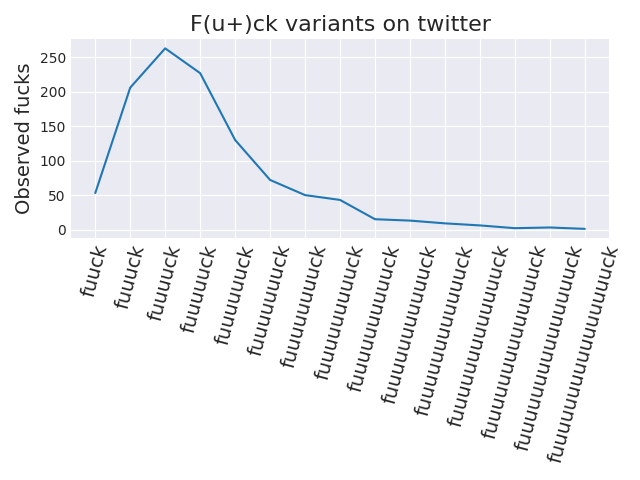
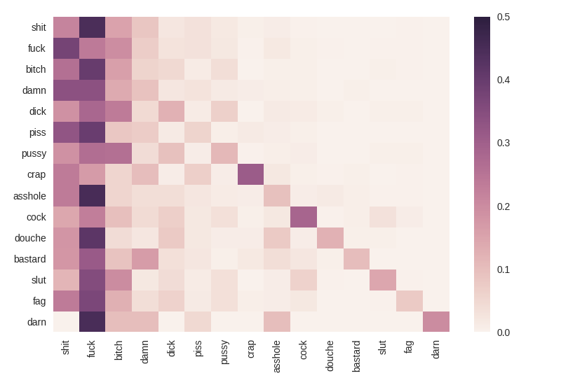

# Twitter fucks

A geographical, statistical, and orthographic study of fucks on twitter, by [@metasemantic](https://twitter.com/metasemantic?lang=en) and [@robotwarning](https://twitter.com/robotwarning).
A total of 10,740,172 tweets were collected, 228,641 contained the word fuck.
The national average is 2.3 fucks per 100 tweets.

### Press & Analysis

+ [Medium](https://medium.com/@travis.hoppe/washington-d-c-gives-no-fucks-be51aa152fe) Washington, D.C. gives no fucks (TH & RM)
+ [Hack && Tell](https://thoppe.github.io/twitterf_cks/HnT_presentation.html) First presented during round 46 (TH)
+ [Reddit](https://www.reddit.com/r/dataisbeautiful/comments/6rosek/fuuuuck_orthographic_repetition_on_twitter_oc/) "Fuuuuck", orthographic repetition on Twitter
+ [7:30 DC](http://mailchi.mp/730dc/are-you-a-young-or-old-millennial-731441) DC DGAF ¯\_(ツ)_/¯
+ [DCist](static/archived_dcist.html) D.C. Gives Fewer F*cks Than The Rest Of The Country (On Twitter, Anyway), _archived version since DCist shut down_

#### Geographical analysis

Full dataset provided in [`data/fucks_to_give_geo.csv`](data/fucks_to_give_geo.csv)


State level aggregation dataset provided in [`data/fucks_to_give_geo_state.csv`](data/fucks_to_give_geo_state.csv). Top and bottom five states listed below:

| State | total tweets | # of fucks per 1000 tweets (US baseline is 21)|
|------ |---------|----|
|MT	| 9976 |10.4|
|AR	| 36957 |11.2| 
|DC	| 94142| 11.7|
|NE	| 42636|13.6|
|MO	| 108180|13.7|
|[...](data/fucks_to_give_geo_state.csv)   | [...](data/fucks_to_give_geo_state.csv) | [...](data/fucks_to_give_geo_state.csv) |
|ND	|7699 |	23.4|
|LA	| 216023| 	23.4|
|AZ	| 173604|	24.8|
|NV	| 127481|	25.9|
|CA	| 1377434|	26.7|
|WY	| 5357|	27.6|


#### Orthographic & Statistical analysis

Measuring variations of fucks like repeated letters. Full dataset provided in [`data/fuck_variations.csv`](data/fuck_variations.csv).




#### Sentiment analysis

Full dataset provided in [`data/fucking_sentiment.csv`](data/fucking_sentiment.csv), selected fucks with the word cat in them are shown.

| cat related tweet | sentiment |
| ------| --------- |
| I hate cats.. just evil little fuckers | -0.9137|
I just want to go to fucking sleep these stupid ass cats are fighting right outside my window |	-0.8542 |
|I just got a cat fucking drunk and he's abusive | -0.7841|
| i want a cat now 😭 who the fuck am i | -0.4939|
| 🗣Let your cat be a fucking cat. | 0|
| honestly scaring cats is fucking hilarious | 0.4754 |
| aye bruh how bout you show yo cats some love too mufucka | 0.6369|
| Cats are just so fucking perfect and I love them and want them all | 0.876|
| I FUCKING LOVE MY CATS SO MUCH LOOK AT THIS BEAUTIFUL GUY I SWEAR WHAT A SMART LOYAL LOVING ANIMAL GIFTED TO ME | 0.9577| 


### Data collection

    python src/scrape.py

Requires a file in the local directory named `access_tokens.json` with the following keys:

``` python
{
    "key":"XXXXXXXXXXXXXXXXXXXXXXXXX",
    "secret":"XXXXXXXXXXXXXXXXXXXXXXXXXXXXXXXXXXXXXXXXXXXXXXXXXX",
    "access":"XXXXXXXXXXXXXXXXXXXXXXXXXXXXXXXXXXXXXXXXXXXXXXXXXX",
    "access_secret":"XXXXXXXXXXXXXXXXXXXXXXXXXXXXXXXXXXXXXXXXXXXXX"
}
```

### Processing

Count and collapse data over geolocations

    python src/geo_count.py

Collect the tweets for a given keyword into a single file

    python src/collect.py

Compute sentiment analysis over the collected tweets

    python src/sentiment_analysis.py
    
### Plotting

Plot propensity over the cities

    python src/plot_cities.py
    python src/plot_states.py
