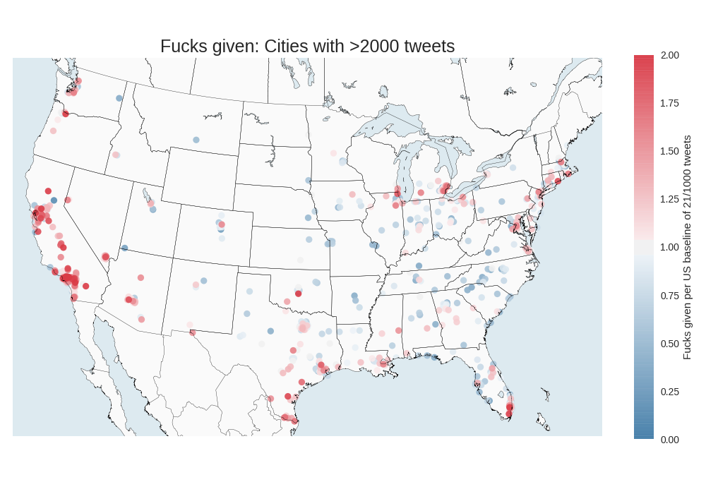
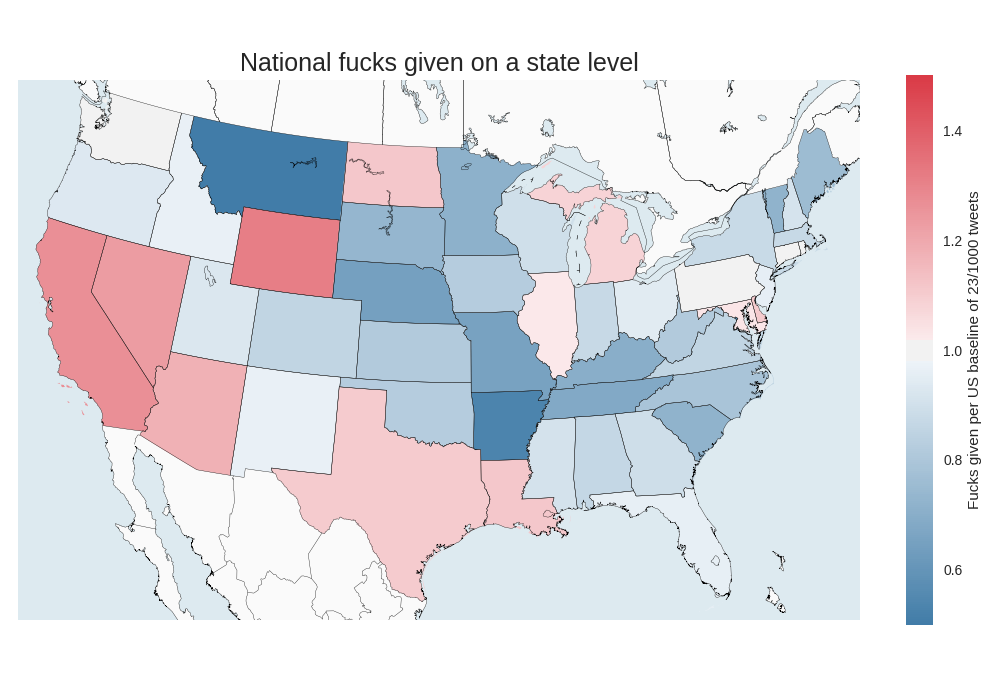

# Twitter fucks

A statistical and orthographic study of fucks on twitter.
A total of 10,740,172 tweets were collected, 228,641 contained the word fuck.
The national average is 2.1 fucks per 100 tweets.





| cat related tweet | sentiment |
| ------| --------- |
| I hate cats.. just evil little fuckers | -0.9137|
I just want to go to fucking sleep these stupid ass cats are fighting right outside my window |	-0.8542 |
|I just got a cat fucking drunk and he's abusive | -0.7841|
| i want a cat now 😭 who the fuck am i | -0.4939|
| 🗣Let your cat be a fucking cat. | 0|
| honestly scaring cats is fucking hilarious | 0.4754 |
| aye bruh how bout you show yo cats some love too mufucka | 0.6369|
| Cats are just so fucking perfect and I love them and want them all | 0.876|
| I FUCKING LOVE MY CATS SO MUCH LOOK AT THIS BEAUTIFUL GUY I SWEAR WHAT A SMART LOYAL LOVING ANIMAL GIFTED TO ME | 0.9577| 


### Data collection

    python src/scrape.py

Requires a file in the local directory named `access_tokens.json` with the following keys:

``` python
{
    "key":"XXXXXXXXXXXXXXXXXXXXXXXXX",
    "secret":"XXXXXXXXXXXXXXXXXXXXXXXXXXXXXXXXXXXXXXXXXXXXXXXXXX",
    "access":"XXXXXXXXXXXXXXXXXXXXXXXXXXXXXXXXXXXXXXXXXXXXXXXXXX",
    "access_secret":"XXXXXXXXXXXXXXXXXXXXXXXXXXXXXXXXXXXXXXXXXXXXX"
}
```

### Processing

Count and collapse data over geolocations

    python src/geo_count.py

Collect the tweets for a given keyword into a single file

    python src/collect.py

Compute sentiment analysis over the collected tweets

    python src/sentiment_analysis.py
    
### Plotting

Plot propensity over the cities

    python src/plot_cities.py
    python src/plot_states.py
